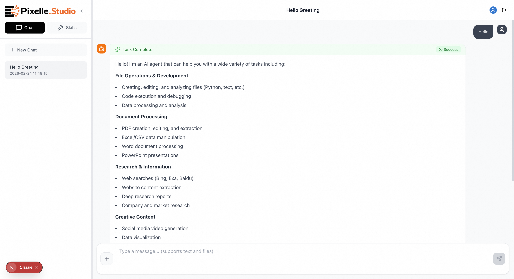
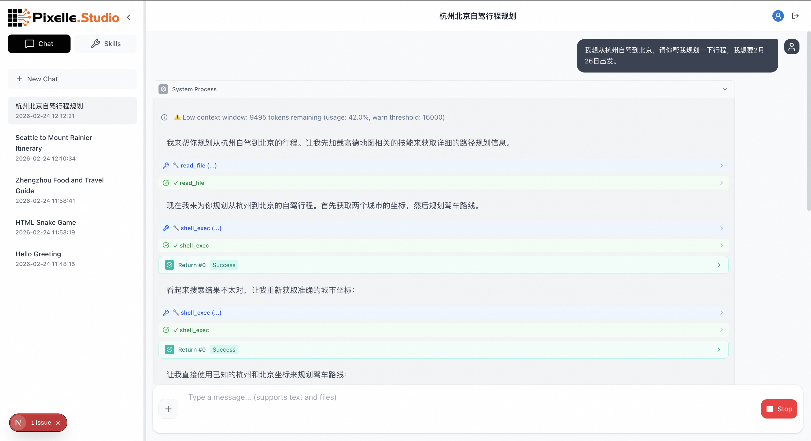
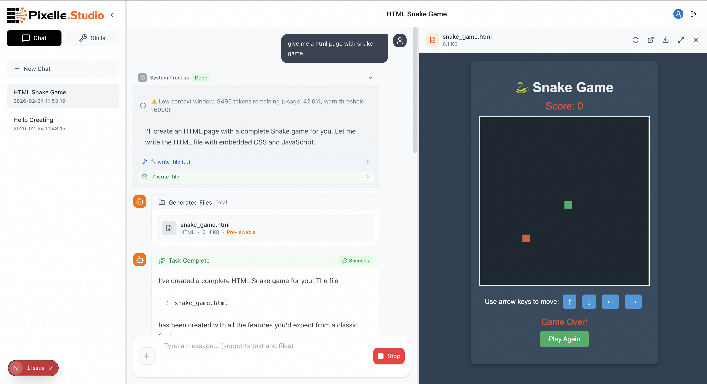
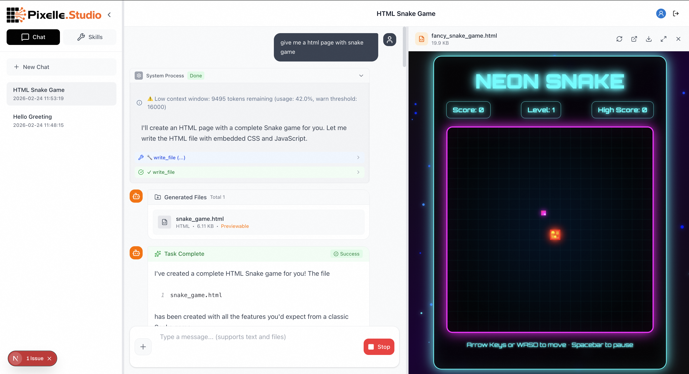
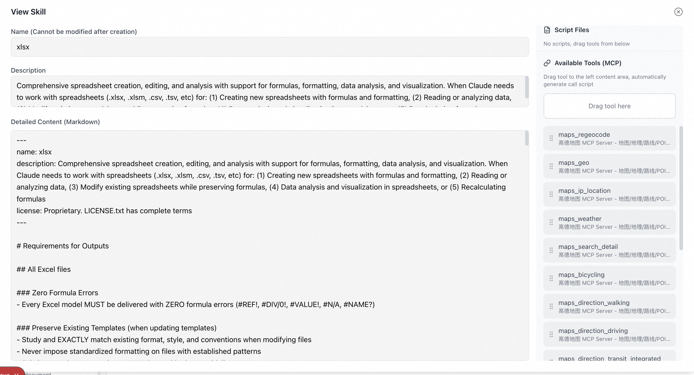
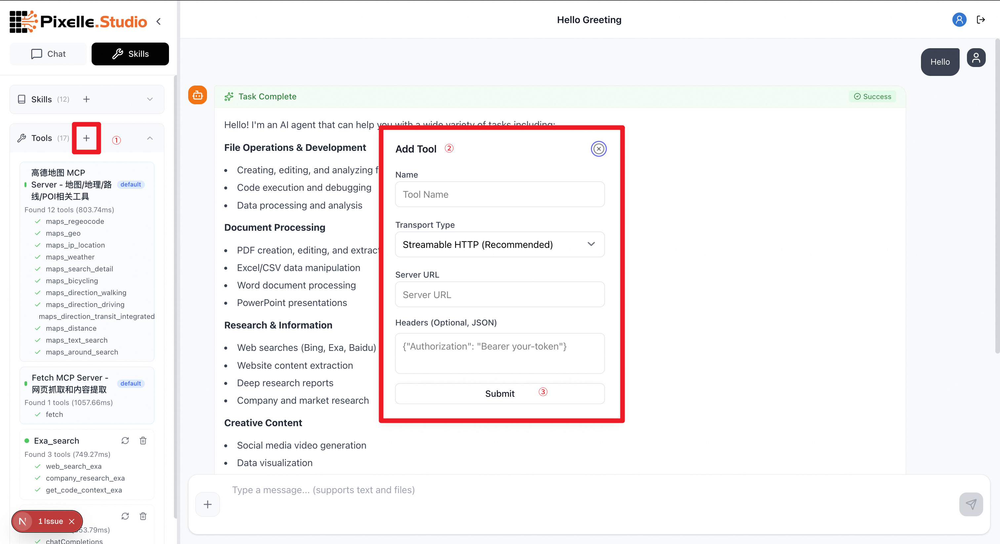

<p align="center">
  
</p>

<p align="center">
  <strong>🚀 Define Workflows in Natural Language — Your Zero-Code AI File Expert</strong>
</p>

<p align="center">
  <code>📄 Full-Format Docs</code>&nbsp;&nbsp;
  <code>🧠 Natural-Language SOPs</code>&nbsp;&nbsp;
  <code>🔌 One-Click Tools</code>&nbsp;&nbsp;
  <code>🛡️ Rock-Solid Stability</code>&nbsp;&nbsp;
  <code>⚡ Token-Smart</code>
</p>

<p align="center">
  <a href="https://github.com/AIDC-AI/Pixelle-Studio"></a>
  <a href="https://github.com/AIDC-AI/Pixelle-Studio/blob/main/LICENSE"></a>
  <a href="https://github.com/AIDC-AI/Pixelle-Studio"></a>
  <a href="https://github.com/AIDC-AI/Pixelle-Studio"></a>
</p>

<p align="center">
  <strong>English</strong> | <a href="README_CN.md">中文</a>
</p>

---

**Pixelle Studio** is an open-source AI Agent workspace built for **expert-level file processing**. Simply **describe your workflow in natural language** to turn daily task SOPs into AI-executable Skills — no complex variable passing or coding knowledge required. Plug in external tools via MCP, and let the Agent reliably generate PDFs, PPTs, Excel files, and more — with three-layer failover for rock-solid stability and progressive loading to save tokens.

> 💡 **Not just a chatbot** — teach AI your workflow in plain language, zero-code your way to an expert file processing agent.

<p align="center">
  
</p>

---

## ✨ Key Highlights

<table>
<tr>
<td width="33%" align="center">
<h3>📄 Expert File Processing</h3>
<p>PDF, Excel, PPT, Word, Markdown, HTML<br>— Generate, preview & download any format</p>
</td>
<td width="33%" align="center">
<h3>🧠 Natural-Language SOP Skills</h3>
<p>Describe workflows in plain language, zero-code<br>— Turn anyone into an Agent expert, no dev skills needed</p>
</td>
<td width="33%" align="center">
<h3>🔌 One-Click Tool Integration</h3>
<p>Plug in search, maps, video & more via MCP<br>— Extend your Agent's reach in seconds</p>
</td>
</tr>
<tr>
<td width="33%" align="center">
<h3>🛡️ Rock-Solid Stability</h3>
<p>Three-layer failover: Auth → Model → Thinking<br>— Service never stops, tasks never break</p>
</td>
<td width="33%" align="center">
<h3>⚡ Token-Smart Engine</h3>
<p>Progressive skill loading saves 90%+ tokens<br>— Smart context compression, never overflow</p>
</td>
<td width="33%" align="center">
<h3>🖥️ Persistent Execution</h3>
<p>Built-in PTY terminal with variable persistence<br>— Multi-step code execution, auto-recovery</p>
</td>
</tr>
</table>

### 🎯 Why Pixelle Studio?

| Feature | Traditional AI Chat Tools | Pixelle Studio |
|---------|:---:|:---:|
| Document Generation (PDF/PPT/Excel) | ❌ Text-only output | ✅ Generate files with live preview |
| Code Execution | ❌ Or plugin-dependent | ✅ Built-in persistent terminal, multi-step |
| Custom Skills | ❌ | ✅ Natural language to define Skills, zero-code |
| External Tools (MCP) | ❌ Closed ecosystem | ✅ Open protocol, plug & play |
| Context Management | ❌ Passive truncation | ✅ Smart compression, auto-managed |
| Multi-Model Failover | ❌ Single model | ✅ Three-layer failover mechanism |
| Token Consumption | 🔴 Full context loading | 🟢 Progressive on-demand loading |

---

## 🖼️ Use Cases

### 1️⃣ Road Trip Planning

> 💬 *"I'd like to drive from Seattle Airport to Mount Rainier, could you please help me with my itinerary? I'm leaving tomorrow morning."*

Agent loads map skills → calls map API → plans the route → generates itinerary document with live preview

<p align="center">
  
</p>

Fully bilingual — the same natural language experience works seamlessly in Chinese too 👇

<p align="center">
  
</p>

### 2️⃣ Deep Research + PPT Generation

> 💬 *"Please help me do some in-depth research on what good food and fun things to do in Zhengzhou. Return the result with a PPT."*

Agent combines multiple Skills → web search → content scraping → structured analysis → auto-generates PPT

<p align="center">
  
</p>

### 3️⃣ Excel Data Analysis & Report Generation

> 💬 *"I have a yearly sales dataset. Summarize revenue by product line per quarter, calculate YoY growth rates, highlight anomalies in red, and generate a financial analysis report."*

Agent reads raw Excel → data cleaning & structuring → uses **native Excel formulas** (`SUM`/`VLOOKUP`/growth rate formulas, not Python-hardcoded values) for summaries → conditional formatting to flag anomalies → `recalc.py` verifies zero formula errors → outputs a professional financial report

**Why more accurate?** Traditional AI tools calculate numbers in Python and paste them into cells — change the data, and everything breaks. Pixelle Studio insists on **native Excel formula-driven** output, producing "living" spreadsheets — edit the source data, and all summaries, growth rates, and charts update automatically.

<p align="center">
  
</p>

### 4️⃣ HTML Games & Interactive Content

> 💬 *"Build me a Snake game"*

Agent writes HTML/CSS/JS → generates a runnable game file → built-in preview for instant play

<p align="center">
  
</p>

### 5️⃣ Create Your Own Skills

Don't just use built-in skills — create your own to teach the Agent your unique workflows:

<p align="center">
  
</p>

---

## 🏗️ Architecture

```
                          ┌──────────────────────────┐
                          │     Frontend (Next.js)    │
                          │  Chat + Skills + Preview  │
                          └────────────┬─────────────┘
                                       │ WebSocket
                          ┌────────────▼─────────────┐
                          │    Backend (FastAPI)       │
                          │      SkillAgent Core       │
                          └────────────┬─────────────┘
                                       │
             ┌────────────┬────────────┼────────────┬────────────┐
             ▼            ▼            ▼            ▼            ▼
      ┌────────────┐┌──────────┐┌──────────┐┌──────────┐┌──────────┐
      │  9 Built-in ││ PTY      ││  Skill   ││ MCP      ││ Context  │
      │  Tools      ││ Terminal ││  System  ││ Tools    ││ Manager  │
      │ read/write  ││Persistent││Progressive││External ││  Auto    │
      │ exec/shell  ││ Sessions ││ Loading  ││Integration│ Compaction│
      └────────────┘└──────────┘└──────────┘└──────────┘└──────────┘
```

### Technical Deep Dive

<details>
<summary><b>🔋 Progressive Skill Loading — The Secret to Token Efficiency</b></summary>

<br>

Unlike traditional approaches that stuff all skills into the System Prompt, we use **three-level progressive loading**:

| Level | Content | Token Cost | When Loaded |
|-------|---------|-----------|-------------|
| Level 1 | Skill metadata (name + description) | ~50 tokens/skill | Every conversation |
| Level 2 | Full SKILL.md documentation | ~500-2000 tokens | On-demand by Agent |
| Level 3 | Auxiliary files (scripts/references) | Variable | On-demand by Agent |

**Result**: 12 built-in Skills consume only ~600 tokens of metadata, while traditional approaches might require 20,000+ tokens.

</details>

<details>
<summary><b>🖥️ Persistent Pseudo-Terminal (PTY) — Beyond Code Execution</b></summary>

<br>

Built on `pexpect`, our persistent Shell Sessions go beyond one-shot code execution:

```python
# Variables persist across multiple calls!
shell_exec("import pandas as pd", shell_type="python")
shell_exec("df = pd.DataFrame({'a': [1,2,3]})", shell_type="python")
shell_exec("print(df.describe())", shell_type="python")  # df still exists!
```

**Advantages**:
- ✅ Variable Persistence — State maintained across calls
- ✅ Multi-language — Bash / Python / IPython
- ✅ Auto-recovery — Automatic restart on session crash
- ✅ Auto-cleanup — Idle sessions automatically recycled

</details>

<details>
<summary><b>🛡️ Three-Layer Failover — Service That Never Stops</b></summary>

<br>

```
Request failed?
  ├─ Layer 1: Auth Failover     → Switch API Key / Base URL
  ├─ Layer 2: Model Failover    → Switch to fallback model (gpt-4o → gpt-4o-mini → ...)
  └─ Layer 3: Thinking Failover → Downgrade thinking depth
```

Even if the primary model faces rate limits, timeouts, or quota exhaustion, the system automatically switches to backup plans, keeping tasks uninterrupted.

</details>

<details>
<summary><b>📐 Smart Context Management — Never Overflow</b></summary>

<br>

- **Context Window Guard** — Real-time token usage monitoring with automatic threshold alerts
- **Auto-Compaction** — When context reaches ~70% usage, automatically generates a summary to compress history
- **Multi-model Aware** — Auto-detects model context window sizes (GPT-4o 128K / Claude 200K / Gemini 1M)

</details>

---

## 🔌 MCP External Tool Integration

Seamlessly connect external tools via the [Model Context Protocol](https://modelcontextprotocol.io/) open standard:

<p align="center">
  
</p>

**Built-in Skills already support these MCP tools**:

| Tool | Function | Use Case |
|------|----------|----------|
| 🔍 Exa Search | AI-native search engine | Deep research, info gathering |
| 🔍 Bing Search | General web search | Real-time information queries |
| 🗺️ AMap (Gaode) | Route planning, POI search | Travel planning |
| 🌐 Web Fetch | Web content scraping | Data collection |
| 🎬 Social Media Video | Video content parsing | Content creation |

> You can also integrate any MCP-compatible tool service!

---

## 🚀 Quick Start

### Prerequisites

- **Python 3.10+** and [uv](https://docs.astral.sh/uv/getting-started/installation/) (Python package manager)
- **Node.js 20+** and npm
- **Docker & Docker Compose** (optional, for containerized deployment)

### Option 1: One-Command Start

```bash
# 1. Clone the repo
git clone https://github.com/AIDC-AI/Pixelle-Studio.git
cd Pixelle-Studio

# 2. Configure environment variables
cp backend/.env.example backend/.env
# Edit backend/.env and add your API key:
# OPENAI_API_KEY=your-api-key

# 3. One-command start (auto-installs dependencies on first run)
./start.sh
```

### Option 2: Docker Compose (Recommended for Deployment)

```bash
# 1. Clone the repo
git clone https://github.com/AIDC-AI/Pixelle-Studio.git
cd Pixelle-Studio

# 2. Configure environment variables
cp .env.example .env
# Edit .env and fill in your API key:
# OPENAI_API_KEY=your-api-key

# 3. Build and start all services
docker compose up -d

# 4. View logs (optional)
docker compose logs -f
```

Then visit 👉 **http://localhost:3000**

<details>
<summary><b>📦 Docker Compose Commands Reference</b></summary>

<br>

```bash
docker compose up -d            # Start all services in background
docker compose up               # Start in foreground (see logs directly)
docker compose down             # Stop all services
docker compose logs -f          # Follow all logs
docker compose logs -f backend  # Follow backend logs only
docker compose up --build       # Rebuild images and start
docker compose ps               # Show running services status
```

**Data Persistence**: The following data is persisted through Docker volumes:
- `backend-data` — SQLite database
- `backend-scripts` — Generated files (PDF/PPT/Excel/HTML etc.)
- `backend-skills` — User-defined skills
- `backend-logs` — Application logs

To reset all data: `docker compose down -v`

</details>

### Option 3: Manual Start

```bash
# Backend
cd backend
uv sync             # Install Python dependencies (creates .venv automatically)
npm install         # Install Node.js dependencies (for PPT/document generation skills)
cp .env.example .env  # Configure environment variables
.venv/bin/python3 -m uvicorn app.main:app --reload --host 0.0.0.0 --port 8001

# Frontend (new terminal)
cd frontend
npm install          # Install Node.js dependencies
npm run dev          # Start dev server (port 3000)
```

Then visit 👉 **http://localhost:3000**

### Environment Variables

| Variable | Description | Default |
|----------|-------------|---------|
| `OPENAI_API_KEY` | OpenAI API Key | Required |
| `OPENAI_BASE_URL` | API Base URL | `https://api.openai.com/v1` |
| `OPENAI_MODEL` | Model to use | `gpt-4o` |
| `FRONTEND_PORT` | Frontend port | `3000` |
| `BACKEND_PORT` | Backend port | `8001` |
| `NEXT_PUBLIC_API_BASE` | Frontend → Backend API URL | `http://localhost:8001/api` |
| `NEXT_PUBLIC_WS_BASE` | Frontend → Backend WebSocket URL | `ws://localhost:8001/ws` |
| `JWT_SECRET` | JWT signing secret | Auto-generated |

> 💡 See `.env.example` for the full list of configurable environment variables.

---

## 🛠️ Built-in Tools

Pixelle Studio provides the Agent with **9 ready-to-use tools**:

| Tool | Function | Description |
|------|----------|-------------|
| `shell_exec` | Persistent terminal | Multi-step execution with variable persistence |
| `exec` | Command execution | One-shot commands / background tasks |
| `read_file` | Read files | Supports skill files and user files |
| `write_file` | Write files | Create scripts / config files |
| `edit_file` | Edit files | Precise string replacement |
| `grep` | Search content | Regex support |
| `find` | Find files | Glob pattern matching |
| `ls` | List directory | Smart limiting to prevent overflow |
| `process` | Process management | Monitor / terminate background tasks |

---

## 📁 Project Structure

```
Pixelle-Studio/
├── frontend/                  # Frontend (Next.js 16 + React 19)
│   ├── app/                   # App Router pages
│   ├── components/            # UI Components
│   │   ├── layout/chat/       # Chat interface
│   │   ├── layout/leftPanel/  # Sidebar (Sessions + Skills)
│   │   └── ui/                # Shared UI components
│   ├── hooks/                 # React Hooks
│   ├── lib/                   # API clients
│   ├── types/                 # TypeScript type definitions
│   └── Dockerfile             # Frontend container image
│
├── backend/                   # Backend (Python + FastAPI)
│   ├── app/
│   │   ├── agent.py           # SkillAgent core engine
│   │   ├── tools/             # 9 built-in tools
│   │   ├── context/           # Context management (Guard + Compaction)
│   │   ├── skills/            # Skill loader
│   │   ├── config/            # Failover configuration
│   │   └── routes/            # REST API routes
│   ├── skills/                # Skills library
│   │   ├── default/           # Built-in skills (PDF/PPT/Excel/Search...)
│   │   └── <user_id>/         # User-defined skills
│   ├── scripts/               # Generated file storage
│   └── Dockerfile             # Backend container image
│
├── docker-compose.yml         # Docker Compose orchestration
├── .env.example               # Environment variable template
├── assets/                    # README assets
└── start.sh                   # One-command start script
```

---

## 🧰 Tech Stack

**Backend**: Python 3.10+ · FastAPI · OpenAI API · WebSocket · SQLAlchemy · pexpect

**Frontend**: Next.js 16 · React 19 · TypeScript · Tailwind CSS

**Infrastructure**: SQLite · MCP Protocol · Docker Compose

---

## 🤝 Contributing

We welcome all contributions! Whether it's bug reports, feature suggestions, or code submissions.

1. Fork the repository
2. Create your feature branch (`git checkout -b feature/amazing-feature`)
3. Commit your changes (`git commit -m 'Add amazing feature'`)
4. Push to the branch (`git push origin feature/amazing-feature`)
5. Open a Pull Request

---

## 📄 License

This project is licensed under the [Apache License 2.0](LICENSE).

---

<p align="center">
  <b>⭐ If this project helps you, please give us a Star!</b>
</p>

<p align="center">
  <a href="https://github.com/AIDC-AI/Pixelle-Studio">GitHub</a> ·
  <a href="https://github.com/AIDC-AI/Pixelle-Studio/issues">Report Bug</a> ·
  <a href="https://github.com/AIDC-AI/Pixelle-Studio/issues">Request Feature</a>
</p>
