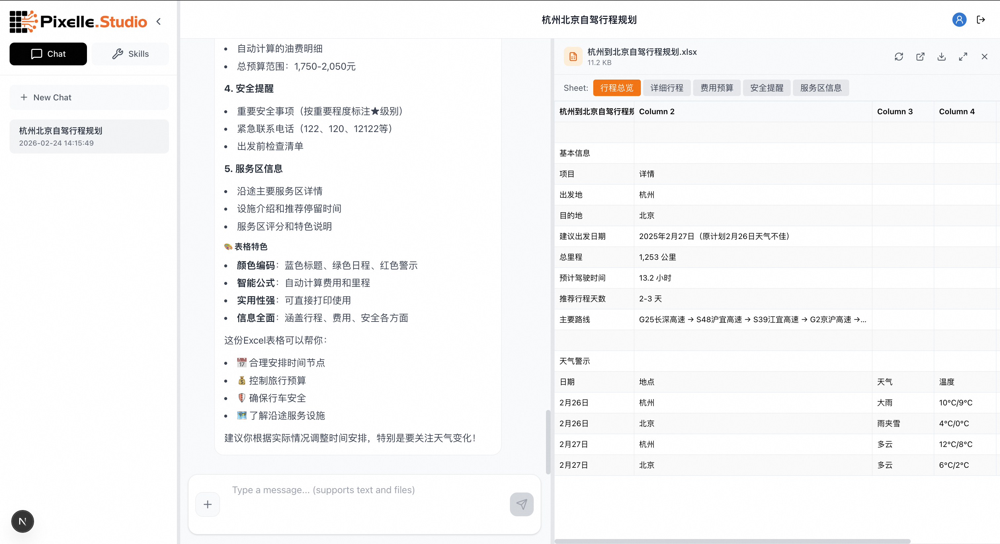
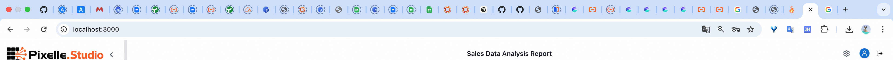
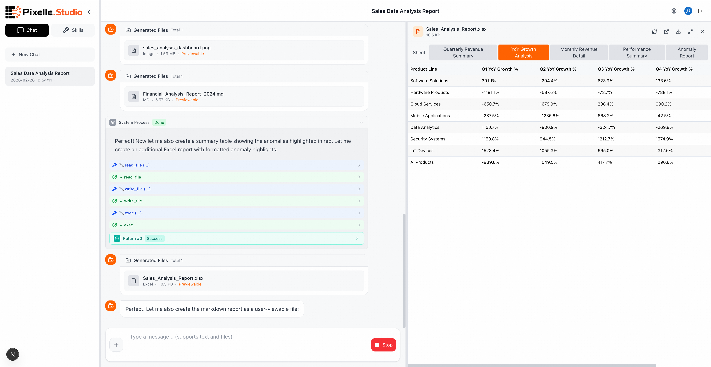

<p align="center">
  
</p>

<p align="center">
  <strong>🚀 用自然语言定义工作流，零代码打造 AI 文件处理专家</strong>
</p>

<p align="center">
  <code>📄 全格式文档处理</code>&nbsp;&nbsp;
  <code>🧠 自然语言定义 SOP</code>&nbsp;&nbsp;
  <code>🔌 一键接入外部工具</code>&nbsp;&nbsp;
  <code>🛡️ 三重容错稳定运行</code>&nbsp;&nbsp;
  <code>⚡ 智能省 Token</code>
</p>

<p align="center">
  <a href="https://github.com/AIDC-AI/Pixelle-Studio"></a>
  <a href="https://github.com/AIDC-AI/Pixelle-Studio/blob/main/LICENSE"></a>
  <a href="https://github.com/AIDC-AI/Pixelle-Studio"></a>
  <a href="https://github.com/AIDC-AI/Pixelle-Studio"></a>
</p>

<p align="center">
  <a href="README.md">English</a> | <strong>中文</strong>
</p>

---

**Pixelle Studio** 是一个开源的 AI Agent 工作台，专注于**专家级文件处理**。只需用**自然语言描述**你的工作流程，就能将日常任务 SOP 转化为 AI 可理解、可执行的技能 —— 告别复杂的变量传递和开发门槛。一键接入外部工具（MCP），稳定生成 PDF、PPT、Excel 等各类文档，三重容错永不中断，渐进式加载智能省 Token。

> 💡 **不只是聊天机器人** —— 用自然语言教会 AI 你的工作方式，零代码让它成为你的文件处理专家。

<p align="center">
  
</p>

---

## ✨ 核心亮点

<table>
<tr>
<td width="33%" align="center">
<h3>📄 专家级文件处理</h3>
<p>PDF、Excel、PPT、Word、Markdown、HTML<br>—— 全格式生成、预览、下载</p>
</td>
<td width="33%" align="center">
<h3>🧠 自然语言定义 SOP 技能</h3>
<p>用自然语言描述工作流，零代码转化为 AI Skill<br>—— 告别复杂开发，人人都能定制 Agent</p>
</td>
<td width="33%" align="center">
<h3>🔌 一键接入外部工具</h3>
<p>搜索引擎、地图、视频等 MCP 工具<br>—— 秒级扩展 Agent 能力边界</p>
</td>
</tr>
<tr>
<td width="33%" align="center">
<h3>🛡️ 三重容错稳定运行</h3>
<p>Auth → Model → Thinking 三层 Failover<br>—— 服务永不中断，任务永不丢失</p>
</td>
<td width="33%" align="center">
<h3>⚡ 智能省 Token</h3>
<p>渐进式技能加载节省 90%+ Token<br>—— 智能上下文压缩，永不溢出</p>
</td>
<td width="33%" align="center">
<h3>🖥️ 持久化代码执行</h3>
<p>内置 PTY 终端，变量跨调用保持<br>—— 多步执行，崩溃自动恢复</p>
</td>
</tr>
</table>

### 🎯 为什么选择 Pixelle Studio？

| 特性 | 传统 AI 聊天工具 | Pixelle Studio |
|------|:---:|:---:|
| 文档生成 (PDF/PPT/Excel) | ❌ 仅生成文本 | ✅ 直接生成文件并预览 |
| 代码执行 | ❌ 或需要插件 | ✅ 内置持久化终端，多步执行 |
| 自定义技能 | ❌ | ✅ 自然语言描述即可，零代码定义 Skill |
| 外部工具 (MCP) | ❌ 封闭生态 | ✅ 开放协议，按需接入 |
| 上下文管理 | ❌ 被动截断 | ✅ 智能压缩，自动管理 |
| 多模型容错 | ❌ 单模型 | ✅ 三层 Failover 机制 |
| Token 消耗 | 🔴 全量加载 | 🟢 渐进式按需加载 |

---

## 🖼️ 使用案例

### 1️⃣ 自驾行程规划

> 💬 *"我想从杭州自驾到北京，请你帮我规划一下行程，我想要2月26日出发。"*

Agent 自动加载地图技能 → 调用高德/Bing 地图 API → 规划路线 → 生成行程文档

<p align="center">
  
  
</p>

支持中英文双语：同样的自然语言体验，对英文用户同样友好 👇

<p align="center">
  
</p>

### 2️⃣ 深度研究 + PPT 生成

> 💬 *"请帮我做一个关于郑州美食和好玩的地方的深度研究，结果用 PPT 呈现。"*

Agent 自动组合多个 Skill → 网络搜索 → 内容抓取 → 结构化分析 → 自动生成 PPT

<p align="center">
  
</p>

### 3️⃣ Excel 数据分析与报表生成

> 💬 *"我有一份公司全年销售数据，帮我按季度汇总各产品线收入，计算同比增长率，异常数据用红色标注，生成财务分析报表。"*

Agent 读取原始 Excel → 数据清洗与结构化 → 使用 **Excel 原生公式**（`SUM`/`VLOOKUP`/增长率公式，非 Python 硬编码）计算汇总 → 条件格式自动标注异常值 → `recalc.py` 校验零公式错误 → 输出专业级财务报表

**为什么更准确？** 传统 AI 工具在 Python 里算好数字再填入表格，数据一变就全废了。Pixelle Studio 坚持用 **Excel 原生公式驱动**，生成的报表是"活"的 —— 修改源数据，所有汇总、增长率、图表自动联动更新。

<p align="center">
  
</p>

<p align="center">
  
</p>

### 4️⃣ HTML 小游戏 & 互动内容

> 💬 *"帮我写一个贪吃蛇小游戏"*

Agent 直接编写 HTML/CSS/JS → 生成可运行的游戏文件 → 内置预览实时体验

<p align="center">
  
</p>

### 5️⃣ 自定义你自己的 Skill

不只是使用预置技能 —— 你可以创建自己的 Skill，让 Agent 掌握你特有的工作流：

<p align="center">
  
</p>

---

## 🏗️ 架构设计

```
                          ┌──────────────────────────┐
                          │     Frontend (Next.js)    │
                          │  Chat + Skills + Preview  │
                          └────────────┬─────────────┘
                                       │ WebSocket
                          ┌────────────▼─────────────┐
                          │    Backend (FastAPI)       │
                          │      SkillAgent Core       │
                          └────────────┬─────────────┘
                                       │
             ┌────────────┬────────────┼────────────┬────────────┐
             ▼            ▼            ▼            ▼            ▼
      ┌────────────┐┌──────────┐┌──────────┐┌──────────┐┌──────────┐
      │  9 内置工具 ││ PTY 终端  ││ 技能系统  ││ MCP 工具 ││ 上下文    │
      │ read/write ││持久化会话 ││ 渐进加载  ││ 外部集成 ││ 智能管理  │
      │ exec/shell ││变量保持   ││ 按需发现  ││ 搜索/地图 ││ 自动压缩  │
      └────────────┘└──────────┘└──────────┘└──────────┘└──────────┘
```

### 技术深潜

<details>
<summary><b>🔋 渐进式技能加载 — Token 节约的秘密武器</b></summary>

<br>

不同于传统方案将所有 Skill 一股脑塞进 System Prompt，我们采用 **三级渐进式加载**：

| 层级 | 内容 | Token 消耗 | 加载时机 |
|------|------|-----------|---------|
| Level 1 | Skill 元数据 (名称+描述) | ~50 tokens/skill | 每次对话 |
| Level 2 | 完整 SKILL.md 文档 | ~500-2000 tokens | Agent 按需加载 |
| Level 3 | 辅助文件 (脚本/参考) | 按需 | Agent 按需加载 |

**效果**：12 个预置 Skill 仅消耗 ~600 tokens 元数据，传统方案可能需要 20,000+ tokens。

</details>

<details>
<summary><b>🖥️ 持久化伪终端 (PTY) — 不只是执行代码</b></summary>

<br>

基于 `pexpect` 实现的持久化 Shell Session，不同于一次性代码执行：

```python
# 变量在多次调用间保持！
shell_exec("import pandas as pd", shell_type="python")
shell_exec("df = pd.DataFrame({'a': [1,2,3]})", shell_type="python")
shell_exec("print(df.describe())", shell_type="python")  # df 仍然存在！
```

**优势**：
- ✅ 变量持久化 — 跨调用保持状态
- ✅ 多语言支持 — Bash / Python / IPython
- ✅ 错误自恢复 — 会话崩溃自动重启
- ✅ 自动清理 — 空闲超时自动回收

</details>

<details>
<summary><b>🛡️ 三层容错机制 — 永不中断的服务</b></summary>

<br>

```
请求失败？
  ├─ 第 1 层: Auth Failover    → 切换 API Key / Base URL
  ├─ 第 2 层: Model Failover   → 切换备用模型 (gpt-4o → gpt-4o-mini → ...)
  └─ 第 3 层: Thinking Failover → 降级思维深度
```

即使主模型遇到限流/超时/配额耗尽，系统也能自动切换备用方案，确保任务不中断。

</details>

<details>
<summary><b>📐 智能上下文管理 — 永远不会溢出</b></summary>

<br>

- **Context Window Guard** — 实时监控 token 使用率，预警阈值自动触发
- **Auto-Compaction** — 当上下文接近 70% 使用率时，自动生成摘要压缩历史消息
- **多模型适配** — 自动识别模型上下文窗口大小 (GPT-4o 128K / Claude 200K / Gemini 1M)

</details>

---

## 🔌 MCP 外部工具集成

通过 [Model Context Protocol](https://modelcontextprotocol.io/) 开放标准，轻松接入外部工具：

<p align="center">
  
</p>

**预置 Skill 已支持的 MCP 工具**：

| 工具 | 功能 | 使用场景 |
|------|------|---------|
| 🔍 Exa Search | AI 原生搜索引擎 | 深度研究、信息收集 |
| 🔍 Bing Search | 通用网络搜索 | 实时信息查询 |
| 🗺️ 高德地图 | 路线规划、POI搜索 | 旅行规划 |
| 🌐 Web Fetch | 网页内容抓取 | 数据采集 |
| 🎬 社交媒体视频 | 视频内容解析 | 内容创作 |

> 你还可以接入任何兼容 MCP 协议的工具服务！

---

## 🚀 快速开始

### 环境要求

- **Python 3.10+** 以及 [uv](https://docs.astral.sh/uv/getting-started/installation/)（Python 包管理器）
- **Node.js 20+** 以及 npm
- **Docker & Docker Compose**（可选，用于容器化部署）

### 方式一：一键启动

```bash
# 1. 克隆项目
git clone https://github.com/AIDC-AI/Pixelle-Studio.git
cd Pixelle-Studio

# 2. 一键启动（首次运行会自动安装依赖）
./start.sh
```

> 💡 启动后打开 **http://localhost:3000**，点击右上角 ⚙️ **Settings** 按钮配置你的 **API Key**、**Base URL** 和 **模型**。

### 方式二：Docker Compose 部署（推荐用于生产环境）

```bash
# 1. 克隆项目
git clone https://github.com/AIDC-AI/Pixelle-Studio.git
cd Pixelle-Studio

# 2. 构建并启动所有服务
docker compose up -d

# 3. 查看日志（可选）
docker compose logs -f
```

启动后访问 👉 **http://localhost:3000**，点击右上角 ⚙️ **Settings** 配置你的 API Key。

<details>
<summary><b>📦 Docker Compose 常用命令</b></summary>

<br>

```bash
docker compose up -d            # 后台启动所有服务
docker compose up               # 前台启动（直接查看日志）
docker compose down             # 停止所有服务
docker compose logs -f          # 查看所有日志
docker compose logs -f backend  # 仅查看后端日志
docker compose up --build       # 重新构建镜像并启动
docker compose ps               # 查看运行中的服务状态
```

**数据持久化**：以下数据通过 Docker Volume 持久化存储：
- `backend-data` — SQLite 数据库
- `backend-scripts` — 生成的文件（PDF/PPT/Excel/HTML 等）
- `backend-skills` — 用户自定义技能
- `backend-logs` — 应用日志

清除所有数据：`docker compose down -v`

</details>

### 方式三：分步启动

```bash
# 后端
cd backend
uv sync              # 安装 Python 依赖（自动创建 .venv）
npm install          # 安装 Node.js 依赖（用于 PPT/文档生成技能）
.venv/bin/python3 -m uvicorn app.main:app --reload --host 0.0.0.0 --port 8001

# 前端（新终端）
cd frontend
npm install           # 安装 Node.js 依赖
npm run dev           # 启动开发服务器（端口 3000）
```

启动后访问 👉 **http://localhost:3000**，点击右上角 ⚙️ **Settings** 配置你的 API Key。

### 配置说明

**LLM 设置**（API Key、Base URL、模型）通过 Web 界面右上角 ⚙️ **Settings** 面板按用户配置 —— 无需环境变量文件。

**基础设施变量**（仅在 Docker 或自定义部署时需要）：

| 变量 | 说明 | 默认值 |
|------|------|--------|
| `FRONTEND_PORT` | 前端端口 | `3000` |
| `BACKEND_PORT` | 后端端口 | `8001` |
| `NEXT_PUBLIC_API_BASE` | 前端连接后端 API 地址 | `http://localhost:8001/api` |
| `NEXT_PUBLIC_WS_BASE` | 前端连接后端 WebSocket 地址 | `ws://localhost:8001/ws` |
| `JWT_SECRET` | JWT 签名密钥 | 自动生成 |

---

## 🛠️ 内置工具一览

Pixelle Studio 为 Agent 提供了 **9 个开箱即用的工具**：

| 工具 | 功能 | 说明 |
|------|------|------|
| `shell_exec` | 持久化终端 | 变量保持的多步执行 |
| `exec` | 命令执行 | 一次性命令 / 后台任务 |
| `read_file` | 读取文件 | 支持技能文件和用户文件 |
| `write_file` | 写入文件 | 创建脚本 / 配置文件 |
| `edit_file` | 编辑文件 | 精确字符串替换 |
| `grep` | 搜索内容 | 支持正则表达式 |
| `find` | 查找文件 | 支持 glob 模式 |
| `ls` | 列出目录 | 智能限制，防溢出 |
| `process` | 进程管理 | 后台任务的查看/终止 |

---

## 📁 项目结构

```
Pixelle-Studio/
├── frontend/                  # 前端 (Next.js 16 + React 19)
│   ├── app/                   # App Router 页面
│   ├── components/            # UI 组件
│   │   ├── layout/chat/       # 聊天界面
│   │   ├── layout/leftPanel/  # 侧边栏 (会话 + 技能)
│   │   └── ui/                # 通用 UI 组件
│   ├── hooks/                 # React Hooks
│   ├── lib/                   # API 客户端
│   ├── types/                 # TypeScript 类型定义
│   └── Dockerfile             # 前端容器镜像
│
├── backend/                   # 后端 (Python + FastAPI)
│   ├── app/
│   │   ├── agent.py           # SkillAgent 核心引擎
│   │   ├── tools/             # 9 大内置工具
│   │   ├── context/           # 上下文管理 (Guard + Compaction)
│   │   ├── skills/            # 技能加载器
│   │   ├── config/            # 容错配置
│   │   └── routes/            # REST API 路由
│   ├── skills/                # 技能库
│   │   ├── default/           # 预置技能 (PDF/PPT/Excel/搜索...)
│   │   └── <user_id>/         # 用户自定义技能
│   ├── scripts/               # 生成的文件存储
│   └── Dockerfile             # 后端容器镜像
│
├── docker-compose.yml         # Docker Compose 编排配置
├── assets/                    # README 素材
└── start.sh                   # 一键启动脚本
```

---

## 🧰 技术栈

**后端**：Python 3.10+ · FastAPI · OpenAI API · WebSocket · SQLAlchemy · pexpect

**前端**：Next.js 16 · React 19 · TypeScript · Tailwind CSS

**基础设施**：SQLite · MCP Protocol · Docker Compose

---

## 🤝 贡献

我们欢迎所有形式的贡献！无论是 Bug 报告、功能建议，还是代码提交。

1. Fork 本仓库
2. 创建特性分支 (`git checkout -b feature/amazing-feature`)
3. 提交更改 (`git commit -m 'Add amazing feature'`)
4. 推送分支 (`git push origin feature/amazing-feature`)
5. 发起 Pull Request

---

## 📄 License

本项目采用 [Apache License 2.0](LICENSE) 开源。

---

<p align="center">
  <b>⭐ 如果这个项目对你有帮助，请给我们一个 Star！</b>
</p>

<p align="center">
  <a href="https://github.com/AIDC-AI/Pixelle-Studio">GitHub</a> ·
  <a href="https://github.com/AIDC-AI/Pixelle-Studio/issues">报告问题</a> ·
  <a href="https://github.com/AIDC-AI/Pixelle-Studio/issues">功能建议</a>
</p>
