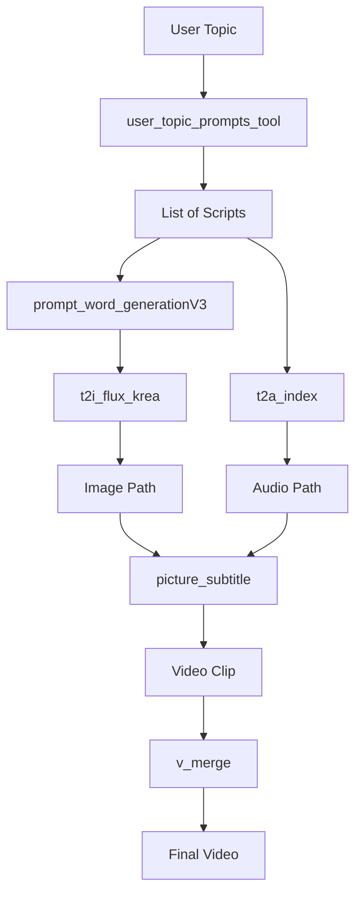

# How to Use the Video Generator MCP Server

## Quick Start

### 1. Test the Server Directly

```bash
cd mcp-server-test
python example_workflow.py
```

This will run a complete workflow demonstration.

### 2. Start the MCP Server

```bash
cd mcp-server-test
python server.py
```

The server will run in stdio mode, ready to accept MCP protocol messages.

### 3. Configure in Main Application

1. Open the main application at http://localhost:5173
2. Click "⚙️ Configure MCP Servers"
3. Click "+ Add MCP Server"
4. Fill in the form:
   - **Name**: `Video Generator`
   - **Type**: `stdio`
   - **Command**: `python`
   - **Arguments**: `/absolute/path/to/mcp-server-test/server.py`

5. Click "Add Server"
6. Enable the server by checking the checkbox
7. Click "Save Configuration"

## Tool Chain Usage Example

When you enter a request like:
```
"Create a social media video about: AI编程技巧"
```

The system will generate a workflow script like:

```python
# Step 1: Generate scripts
scripts = call_tool('user_topic_prompts_tool', {'topic': 'AI编程技巧'})

# Step 2-5: Process each script
video_clips = []
for script in scripts:
    # Generate image prompt
    prompt = call_tool('prompt_word_generationV3', {'script_segment': script})
    
    # Generate image and audio in parallel (or sequentially)
    image = call_tool('t2i_flux_krea', {'image_prompt': prompt})
    audio = call_tool('t2a_index', {'script_segment': script})
    
    # Combine into video
    clip = call_tool('picture_subtitle', {
        'image_path': image,
        'audio_path': audio
    })
    video_clips.append(clip)

# Step 6: Merge all clips
final_video = call_tool('v_merge', {'video_paths': video_clips})
```

## Tool Dependencies Diagram



## Testing with MCP Inspector

```bash
npx @modelcontextprotocol/inspector python server.py
```

This will launch an interactive browser-based tool inspector where you can:
- View all available tools
- Test individual tool calls
- See request/response messages
- Debug tool implementations

## Expected Output

When running the example workflow, you should see:

```
Step 1: Generating script segments...
[generate_script] Generated 3 segments

Processing segment 1/3...
  [image_prompt] A professional presenter...
  [generate_image] /storage/images/flux_gen_1234.png
  [generate_audio] /storage/audio/tts_5678.mp3 (3.0s)
  [combine] Created /storage/videos/clip_9012.mp4

...

[merge] Merged 3 clips → /storage/videos/final_video_12345.mp4
```

## Notes

- All paths are mock - no actual files are created
- Tool outputs are deterministic within a run but random across runs
- Perfect for demonstrating complex multi-tool workflows
- Can be extended to real implementations by replacing mock logic in `video_tools.py`
